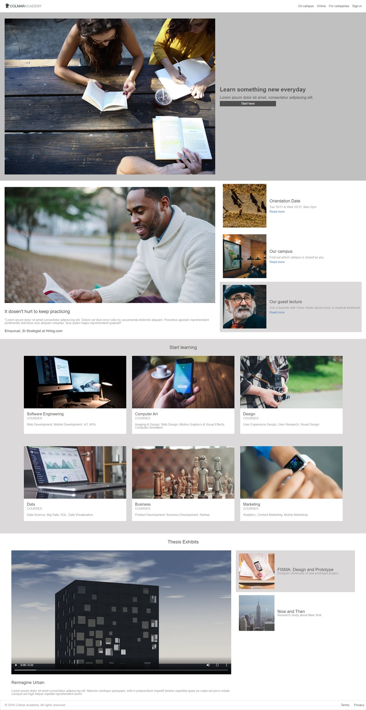
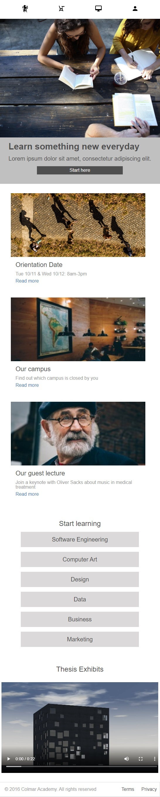

# webassessment: Colmar Academy

Assessment Requirements: 
Build a responsive website from scratch & explain the thought process when building the web site.

- [Overview](#overview)
  - [Criteria](#criteria)
  - [Screenshot](#screenshot)
- [Development Process](#development)
  - [Built with](#built-with)
  - [My Reflections](#Reflections)

## Overview

### Criteria
- Website is responsive on desktop and web
- Code is clean and well written
- Page style accurately reflects specs given
- Website is deployed to Github Pages and accessible from a link

### Screenshot

## Development

### Built with

- HTML
- CSS custom properties
- Flexbox

### Reflections

- What did you like about this project?
Being able to work on something new seems really fun and challenging at the same time. I feel a little sense of achievement when I am able to create something new.

- What did you struggle with in this project?
For the mobile view, the use of <picture> tag for responsive design caused my initial image size at css to not work properly. I had to keep trying different ways to change it back to how it was before. Took me really long :( It was also really difficult to find solutions for this problem online too. But luckily eventually I could still figure it out on my own. 

- What would make your experience with this assessment better?
I feel that all is good.